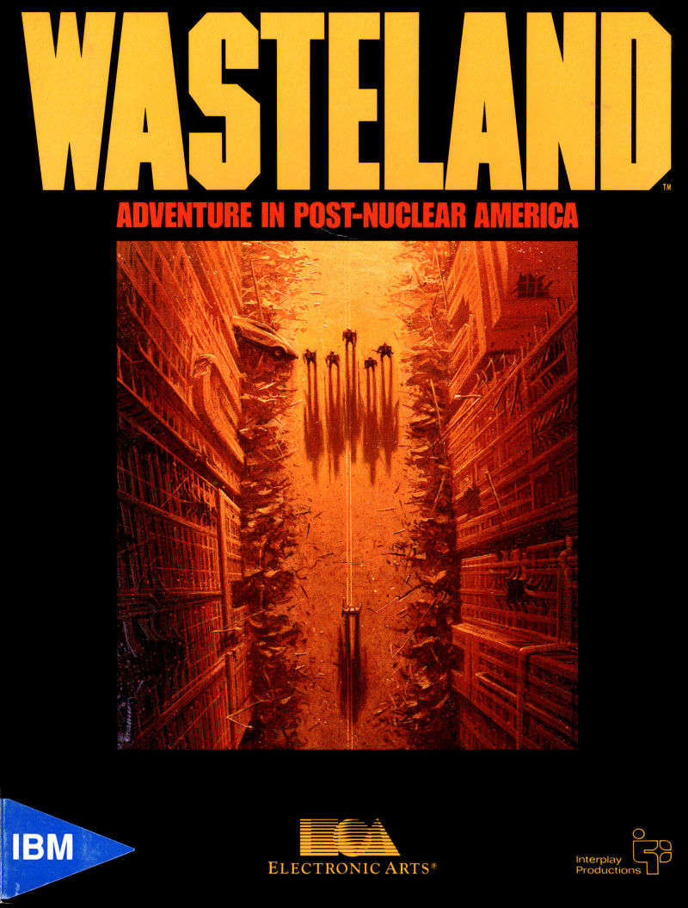
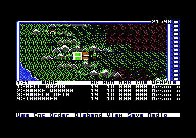

# wasteland-c64-patched

*The case of the four rangers who refused to be edited — and the disk that fought back.*



This one's for those of us who fondly remember the Commodore 64 and its awesome repertoire of games. My personal favorite was **Wasteland**, which was a major evolution of the RPG genre. Where earlier RPGs marched you down linear paths, Wasteland gave you a deep skill-based system, a persistent open world, and NPCs with minds of their own, who didn't always do what they were told.

As a kid, I'd always wanted to dig into the rangers' character data and tune their stats so I could explore the whole world without dying too easily, but I didn't have the know-how to pull it off. Decades later, with Claude's help, I finally was able to. Working with Claude through the rough spots and obstacles together, the childhood dream came true at last.

Tools and notes from a hex-detective's investigation into the C64 version of **Wasteland**: how to crack open the party roster, max out the team, and get the edited `.d64` to boot without tripping the game's anti-tamper trap.

Read [HOW-PATCH-WITH-CMDs.md](HOW-PATCH-WITH-CMDs.md) for all the gory details.

## The curious case of the disk that fought back

The lead seemed simple enough: find four characters on a disk image, give them godlike stats, write it back. But Wasteland had laid traps for exactly this kind of meddling.

**The first wall.** The character names weren't on the disk — not in plain ASCII, not high-bit-set, not anywhere obvious. The roster was *encrypted*: a cluster of small high-entropy records tucked near the end of the image, standing out from the near-empty padding around them only when you scan it sector by sector. (An entropy map does flag one *big* loud island mid-disk — but that turns out to be the compressed game binary, a red herring, not the party.)

**The break-in.** We knew the plaintext — the rangers are named `HELL RAZOR`, `SNAKE VARGAS`, and friends. Sliding those known names across the ciphertext gave up the key: a simple XOR scheme keyed to a single *seed* byte plus the byte's position. The records decrypted. We had them.

**The trap springs.** We maxed the stats, re-encrypted, booted it… and the game demanded "insert disk 3" and threw an I/O error. Even flipping a *single byte* triggered it. An anti-tamper checksum was guarding the block.

**The locked vault.** But the deeper logic — the checksum routine itself — refused to show on disk at all. The main game binary ships **compressed** (a Huffman-style bit-stream, unpacked by a decompressor hiding in the track-35 code). Read the disk bytes and you get packed garbage; the real 6502 only exists once it's inflated into RAM at boot. Static disassembly was a dead end. The whole investigation had to move **live**: boot the game in a VICE emulator, let it decompress and decrypt itself into memory, then hunt the routine with watchpoints and monitor dumps while it ran.

**The twist.** Reverse-engineering the routine in an emulator revealed the cruel elegance of it: **the checksum *is* the encryption seed.** Change one stat and the checksum changes, which changes the key for the *entire* block — so any naive edit corrupts itself twice over. That's why the trap was unbeatable by hex-editing alone.

**The final clue.** One question remained: if the seed is the checksum of the *decrypted* data, how does the game decrypt on load before it has the plaintext to checksum? Chicken, meet egg. Watching the loader in the debugger cracked it — the seed rides on disk **in plaintext**, parked at offset `0xFF` of the party-metadata sector, the one byte both the cipher loop and the checksum loop deliberately skip. The game just *reads* it there (`LDA $F4FF`) before decrypting. No paradox, just a clever hiding spot.

**Case closed.** `wl_patch.py` walks the whole solution: read the stored seed, decrypt the records, apply your edits, recompute the checksum (the new seed), tuck the seed back into byte `0xFF`, re-encrypt bytes `0x00–0xFE`, and write it back. And because a detective trusts but verifies, it's **self-checking** — before *and* after writing, three independent witnesses (the stored seed byte, a fresh known-plaintext name slide, and the recomputed checksum) must all agree, or it refuses to touch the disk.

**Tip of the hat.** A genuine round of applause for **Alan Pavlish**, Lead Programmer & Designer of *Wasteland*. Folding the checksum into the encryption seed — so that the very act of tampering scrambles the key to the entire block — is a devilishly clever piece of work. In 1988, on a 6502, with bytes to spare for booby traps, he built an anti-cheat scheme elegant enough that it took an emulator, a debugger, and a fair bit of detective work to unravel decades later. Beautifully done.



*The payoff: four maxed rangers, valid checksum, no tamper trap.*

## Usage

```sh
# Interrogate the disk: show the party and confirm the checksum model matches
python3 wl_patch.py inspect "disk.d64"

# Pull off the heist: max all four characters (writes disk.d64.bak first)
python3 wl_patch.py max "disk.d64" [--out OUT.d64] [--value 99] [--con 999] [--skill 255]
```

For full control over the roster, `wl_complete_patch.py` is an interactive party editor. Where `wl_patch.py max` is the blunt heist, this is the safecracker's full kit — it walks you through each ranger and lets you rewrite attributes (STR, IQ, LCK, SPD, AGI, DEX, CHA), max/current constitution, skill points, the skill list (add, remove, or set levels on any of the 35 skills), and inventory (add/remove items, reusing `wl_inventory.py`). A `[f]ull-max ALL` shortcut hands every ranger god stats, 30 maxed skills, and a complete god loadout (Meson cannon, Power armor, NATO assault rifle, ammo, and field gear). It re-seals the disk image exactly like `wl_patch.py` — same backup, same checksum/seed recompute, same three-witness verification before anything is written.

```sh
# Open the full interactive editor on a disk image
python3 wl_complete_patch.py "disk.d64"
```

**Keep the kit together.** `wl_complete_patch.py` isn't self-contained — it imports `wl_patch.py` (for the crypto and disk layout) and `wl_inventory.py` (for the inventory editor), which in turn imports `wl_patch.py`. All three files must sit in the same directory or Python will fail on import. Run them from that directory (or put it on your `PYTHONPATH`). `wl_patch.py` is the one tool that stands alone.

Always test the result in an emulator before trusting it — even a solved case deserves a second look.

## Evidence files

- `wl_patch.py` — the party editor and the foundation of the kit: all the crypto, disk layout, and three-witness verification live here. Stands alone (depends only on the Python standard library); the other two scripts import it.
- `wl_inventory.py` — the interactive inventory editor (add/remove items). Imports `wl_patch.py`.
- `wl_complete_patch.py` — the full interactive ranger editor: attributes, constitution, skill points, skills, and inventory, plus a one-key full-max for the whole party. Imports both `wl_patch.py` and `wl_inventory.py`, so all three files must live in the same directory.
- [`HOW-PATCH-WITH-CMDs.md`](HOW-PATCH-WITH-CMDs.md) — the full case file, command by command: locating the characters, breaking the cipher, springing (and understanding) the checksum trap, and tracing exactly where the game hides and reads the seed — with every Python probe and VICE monitor session you need to reproduce it.
